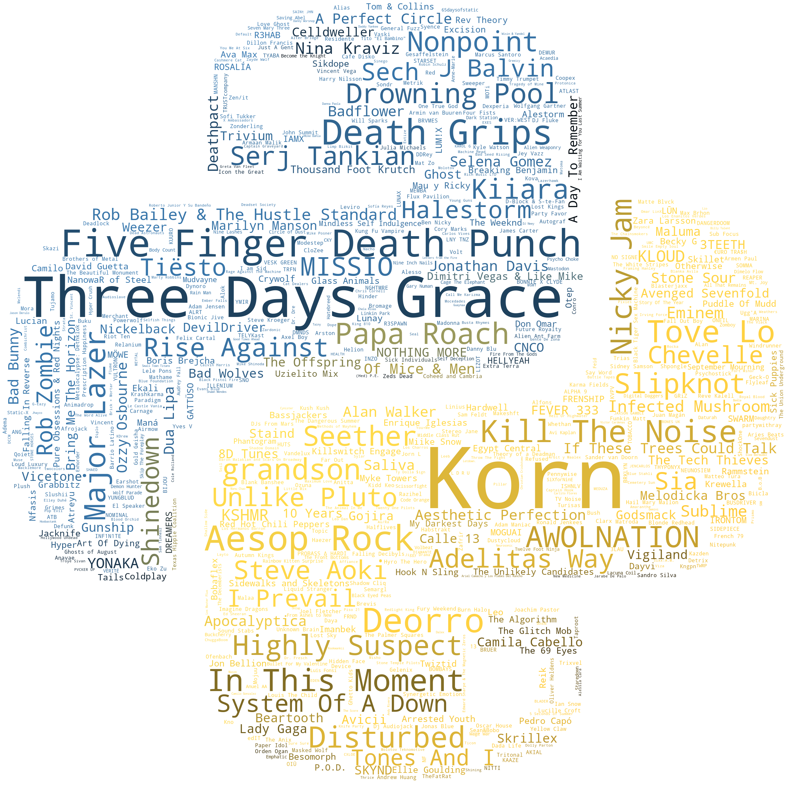

<h1 align="center">
  <br>
  SpotiPy: Playlist to Wordcloud
  <br>
</h1>

<h4 align="center">WIP refactoring of final project for CS50P - Intro to Programming with Python.

<p align="center">
  <a href="#key-features">Key Features</a> •
  <a href="#extended-details">Extended Details</a> •
  <a href="#how-to-use">How To Use</a> •
  <a href="#credits">Credits</a> •
  <a href="#contact">Contact Me</a>
</p>



## Key Features

* Utilize API connection to pull artist names, tracks, and track ID from given playlist
* Select an image to use for colors and mask in generated wordcloud
* Artist wordcloud is generated by number of songs per artist
* Title names wordcloud is generated by frequency of words within titles

## Extended Details
I am a frequent Spotify listener and often find new songs through their 'Discover Weekly' and 'Release Radar' functions, rather than simply following select artists.  I have a long-running playlist (years at this point!) and I have been interested to see what artists float to the top, as well as if there is any pattern in the song titles.

For this project, I utilized Spotipy to access data from my personal playlist via an API call; see function: get_playlist_ids(username,playlist_id) which returns a list of lists containing artist name, song title, and song ID.

I then chose to visualize this data using a wordcloud. Function create_artist_cloud() generates a word cloud by frequency of artist name in my playlist and superimposes it over the Python logo with boundaries.  Function create_artist_cloud() utilizes the occurences of words in the titles to mapped over the spotify logo with a gradient.

For unit tests, see test_project.py.  Tests include: verifying that the artist wordcloud has been generated, verifying that the song title wordcloud has been generated, and verifying that the length of the playlist returned by the API call is equal to the current number of songs present on the playlist in spotify (1268).

See requirements.txt for pip-installable libraries needed to run this project.

TODO:
There is redudancy in code for some of the functionality relating to obtaining an image from a URL and setting a mask. Breaking this into smaller functions failed within the CS50P codespace and will need additional work.

## How To Use
....WORKING....

To clone and run this, you'll need [Git](https://git-scm.com) installed on your computer. From your command line:

```bash
# Clone this repository
$ git clone https://github.com/Obscureagain/Spotify

# Go into the repository
$ cd Spotify

# Install dependencies
$ pip install -r requirements.txt
```

## Credits

This project was successful largely due to learning from the following resources:

- [CS50P Intro to Programming with Python](https://cs50.harvard.edu/python/2022/)
- [Spotipy!](https://spotipy.readthedocs.io/en/2.21.0/)

## Contact

> GitHub [@Obscureagain](https://github.com/Obscureagain) &nbsp;&middot;&nbsp;
> LinkedIn [@asullivan22](https://www.linkedin.com/in/asullivan22/)